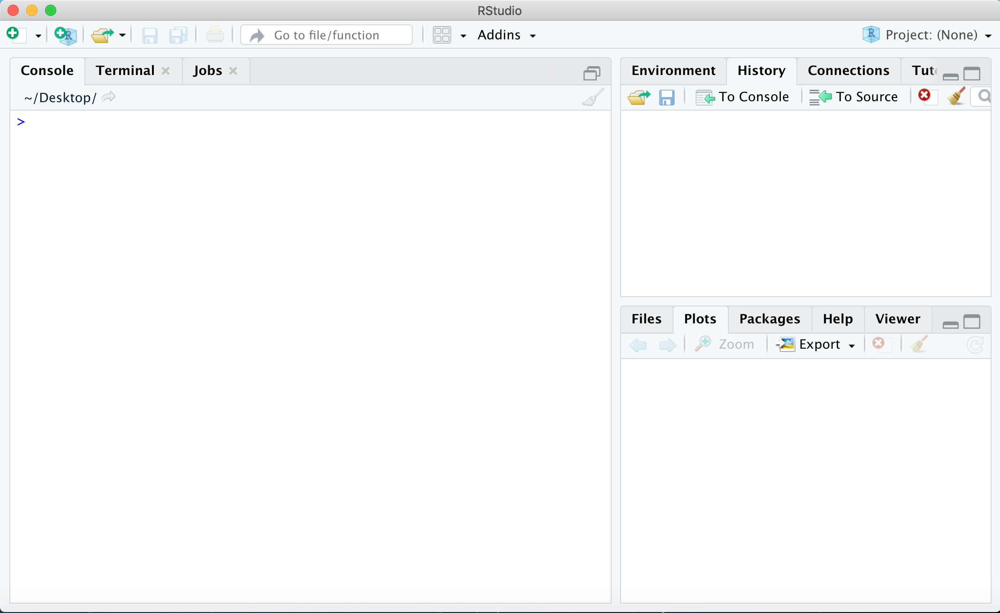

# Introduction {#intro}

In this class, we will use the R language, and the RStudio integrated development environment (IDE). Before the first meeting, install the necessary software on your personal computer by executing the following instructions.

## Installing R and Rstudio
Go to the website of the Comprehensive R Archive Network (https://cran.r-project.org/) and download the latest version of R for your operating system (Windows, MacOS, or Linux). As of \today, the latest version is 4.0.4. Follow the installation instructions.

Next, go the Rstudio download website
(https://rstudio.com/products/rstudio/download/) and get the Desktop version
(open source license). As of \today, the version is 1.4.1106. Follow the
installation instruction. An icon that looks like this:
`r include_image("images/RstudioLogo.png", html_opts="height=20px", latex_opts="height=2.5%")`
will be on your computer's desktop. Double-click on this icon to start the R session. The Rstudio IDE will open, and look like this:

```{r, fig.align="center", echo=FALSE, out.width="70%"}

```


The left-hand side of the screen contains the Console tab. Notice the $>$ sign (called the 'prompt'). When you see this character, it means the R is ready for the next command. Put the cursor there, and then type

```
2 + 2
```

and hit Enter on the keyboard. You should get the following on the Console:
```{r, echo=FALSE, comment=""}
2 + 2
```

Notice the top-right part of the Rstudio window. You should see an 'Environment' and a 'History' tab. Click on History. Notice that your previous input appears there. Try entering another calculation or command and see that they appear in the session's history. For example, try entering the following 
```{r, comment="", eval=FALSE}
3 ^ 5
date()
```

Click on the Environment tab. It should be empty when you start R for the first time. In the Console, type
```{r, comment="", eval=FALSE}
myFirstVariable <- factorial(5)
```
Notice that nothing was printed in the Console, but the Environment tab now contains a table with one row, with 'myFirstVariable' appearing in the cell on the left, and its value (120) on the right. Any object appearing in the Environment tab is available to you throughout your R session, and you don't have to recalculate it. For example, you can try the following:
```{r ,comment="", eval=FALSE}
myFirstVariable/6
```
The Console should now display 20.

The lower-right side of the IDE contains a file browser (the Files tab), information about installed packages (more about it later), and any plot generated during the R session. It also contains a Help tab, to obtain information about built-in functions.

Finally, before we move on to the next section, in the Rstudio top menu, click on File, then on New File, and then on R Script. Alternatively, you can click on little green '+' icon in the top-left part of the IDE. This will split the left side of the Rstudio IDE into two parts -- the lower part will contain the Console, and the top part will contain a tab labeled 'Untitled1'. This is were you can enter R code which you will save to a permanent file, and re-use later.
For example, enter the following in the blank space in the Untitled1 tab:
```{r, comment="", eval=FALSE}
# This is my first R program
cat('Hello, World!\n')
```
Then, click on File $>$ Save, and in the 'Save As' box enter FirstProgram.R and click the Save button.
Notice that the tab name is now FirstProgram.R.

In that part of the window, there should now be a small button called Source. Click on it. The program will be executed and the output will be shown in the Console. You can also execute individual lines in the source code. Just put the cursor anywhere in that line, and click on the Run button (which is near the Source button.)

That's it. In the rest of these notes we will see more features of Rstudio, but you are now ready to start learning programming in R.


## Basic Operations in R
### Generating random numbers
In this course, much of the learning will be done by using simulated data, so let's start by learning how to generate data. The basic function to generate random data is \texttt{runif} which is used to draw random numbers, uniformly between 0 and 1. In the following example we create 10,000 random draws from a uniform distribution, keep these numbers in a variable called simData, and plot a histogram to show the distribution of the data we have generated. The \texttt{set.seed} function is used to ensure that every time we run this code, we will get the same set of random numbers. This is called \textit{reproducible code}. 
```{r, echo=TRUE, comment=""}
# Generate 10,000 points from a uniform distribution
set.seed(210313)
n <- 10000
simData <- runif(n)
hist(simData)
```

From the range and the flatness of the histogram we can see that the generated data is indeed uniform on [0,1]. The \texttt{runif} function can be used to draw random numbers uniformly on any finite interval. For example, if we want our random numbers to be in the interval [1,5] we will run the following code:
```{r, echo=TRUE, comment=""}
simData <- runif(n, min=1, max=5)
```
Try it, and draw the histogram as in the previous example.

From a random draw of a uniform distribution, we can generate random numbers from other distributions. For example, we want to simulate coin flips, and count the number of Heads that we get. Let's say we want to simulate 200 coin tosses. We will draw 200 random numbers from a uniform distribution, and decide that we got Heads in the $i$-th toss if the $i$-the random number is less than 0.5, and Tails otherwise.
Try the following code multiple times. What do you observe? We will discuss it further in a different lecture.
```{r, echo=TRUE, comment=""}
n.trials <- 200
cat("Number of Heads is: ", sum((runif(n.trials) < 0.5)), "\n")
```

Statistical inference is based on a mental exercise in which we ask, if we could repeat the same experiment infinitely many times, what would we see? With simulations, we can get a good approximation. For example, the 200 coin-tosses experiment can be repeated, say, 100 times. One way is to use loops, like in the following example:
```{r, echo=TRUE, comment=""}
n.trials <- 200  # the number of coin-tosses in each experiment
reps <- 100  # the number of experiments
Heads <- rep(0, reps)  # A vector to store the results (initialize with 0s)
for (i in 1:reps) {
  Heads[i] <- sum((runif(n.trials) < 0.5))
}
hist(Heads, breaks=30)
```

We have used a \texttt{for} loop, with an index variable called \texttt{i} which runs from 1 to 100. In each iteration we draw $n.trials=200$ random numbers from a uniform distribution. For each value which turned out to be less than 0.5, \texttt{runif(n.trials) < 0.5} is set to TRUE. Otherwise, \texttt{runif(n.trials) < 0.5} is set to FALSE. When we use the \texttt{sum} function, the TRUE values count as 1 each, while FALSE ones counts as 0, so the result is the number of Heads. The results is stored in the $i$-th position in the vector we called \texttt{Heads}.

Using the uniform distribution, we have created a random draw from a different distribution, called the `binomial'. The mathematical notation is $Bin(N, p)$ where $N$ is the number of trials such that in each trial there can be exactly two outcomes (e.g., coin tosses), and $p$ is the probability of the first possible outcome (e.g., Head), and $1-p$ is the probability of the second possible outcome.

R has a built-in function to generate random numbers from many different distributions, so the code above can be replaced by the following, which uses the \texttt{rbinom} function:
```{r, echo=TRUE, comment=""}
Heads <- rbinom(reps, n.trials, 0.5)
hist(Heads)
```


Exercises:
\begin{enumerate}
\item Change the number of simulated coin-toss datasets (\texttt{reps}) to 1,000 and rerun the code. Then change it to 10,000 and run it again. What do you notice?
\item Change the probability of Heads to 0.2 and run the code again. Then, change it to 0.8. What do you observe?
\item Try other values of the number of trials and the probability of Heads.
\end{enumerate}

### Summary statistics
Let's generate some data:
```{r, echo=TRUE, comment=""}
n <- 10000
lambda <- 10
x <- -log(runif(n))/lambda
```
We will introduce some statistical functions to summarize data. The most commonly used one is the mean (a.k.a. the average), $\overline{x}$:
$$\overline{x}=\frac{x_1+\ldots+x_n}{n}\,.$$
Other ways to estimate some sort of `central tendency' of a distribution are:
 (i) the trimmed mean, which is similar to the mean, except that the smallest and largest $p\cdot 100\%$  of the values are excluded from the computation. For example, if we take $p=0.1$ with the simulated data, only 800 data points are used in the calculation of the trimmed mean; (ii) The median is a number, $x_{0.5}$, such that half the data points are greater than $x_{0.5}$ and half are less than or equal to $x_{0.5}$. 

Try the following:
```{r, echo=TRUE, comment=""}
mean(x)
mean(x, trim=0.1)
median(x)
```

The distribution of $x$ is shown below as a \textit{box-and-whisker plot} (or simply, boxplot). This is a very simple representation of numeric data, which is constructed by summarizing the data using a few numeric characteristics. The boxplot below is drawn horizontally, and the vertical grey line inside the box is the median. Similar to the median, we find the first quartile -- a point $x_{25}$ such that 25\% of the values are less than $x_{25}$ and 75\% are greater than $x_{25}$; and the third quartile -- a point $x_{75}$ such that 75\% of the values are less than $x_{75}$ and 25\% are greater than $x_{75}$. The first and third quartiles are the vertical edges of the box, also called the lower and upper hinges. So, the box represents 50\% of the data. The range between the first and third quartiles is called the \textit{Inter-Quartile Range}, or IQR.
The 'whiskers', which are the dashed grey lines, are constructed by adding 1.5$\cdot$IQR to each side of the box. If the result is smaller than the minimum value (or greater than the maximum), then the whisker only extends to the minimum (maximum). Points within the range between the two whiskers are not plotted individually, since their distribution is summarized succinctly by the box-and-whiskers plot. Points outside the range between the two whiskers are considered 'outliers', or extreme values, and are shown explicitly. 

<!--
\begin{center}
\includegraphics[width=0.7\textwidth]{Note01BoxplotExp10}
\end{center}
-->

A boxplot does not include the mean, or the trimmed mean, but we have added them here as a red circle and brown diamond, respectively, in order to show that they are different than the mean. The mean is smaller in this case, because the distribution is skewed to the left -- there are many more data points in the range closer to zero, so the sample mean is affected by this large number of small values. The median, on the other hand, does not depend on the scale of the data. It simply represents where half the data lies. 

The plot was generated with the following code. Try it, and try changing some of the parameters to understand their role. We will cover the details in a chapter dedicated to visualization.

```{r, echo=TRUE, comment=""}
boxplot(x, cex=0.5, col=4,border = "grey66", horizontal = T, axes=F, at=0.25)
axis(1, pos = 0)
points(mean(x),0.25,col=2, pch=19, cex=0.7)
points(mean(x, trim=0.1),0.25, col="brown", pch=18)
```


var, sd, fivenum, summary, quantile, 
discrete data
matrices
density plot
Q-Q plot
more distributions - Poisson, normal, beta, gamma, lognormal


<!--
KEEP LINE WIDTH UNDER 70 IN SOURCE
(We need to develop a few styles that we all agree on and keep them).

You can label chapter and section titles using `{#label}` after them
, e.g., we can reference Chapter \@ref(intro). If you do not manually
label them, there will be automatic labels anyway, e.g., 
Chapter~\@ref(ch:estimation).


Figures and tables with captions will be placed in
`figure` and `table` environments, respectively.

```{r nice-fig, fig.cap='Here is a nice figure!', out.width='80%', fig.asp=.75, fig.align='center'}
par(mar = c(4, 4, .1, .1))
plot(pressure, type = 'b', pch = 19)
```

Reference a figure by its code chunk label with the `fig:` prefix,
e.g., see Figure~\@ref(fig:nice-fig). Similarly, you can reference
tables generated from `knitr::kable()`, e.g., see 
Table~\@ref(tab:nice-tab).

```{r nice-tab, tidy=FALSE}
knitr::kable(
  head(iris, 20), caption = 'Here is a nice table!',
  booktabs = TRUE
)
```

You can write citations, too. For example, we are using the
**bookdown** package [@R-bookdown] in this sample book,
which was built on top of R Markdown and **knitr** [@xie2015].
-->
